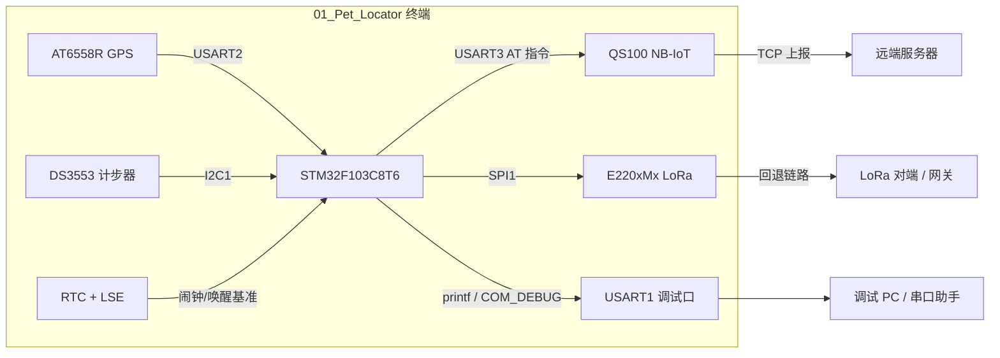
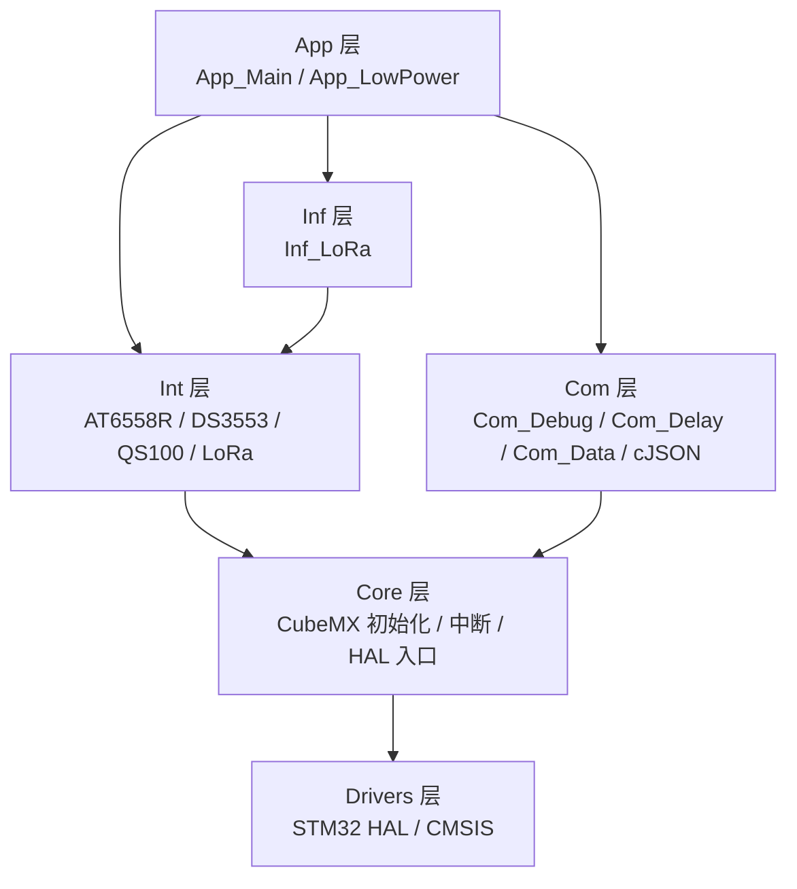
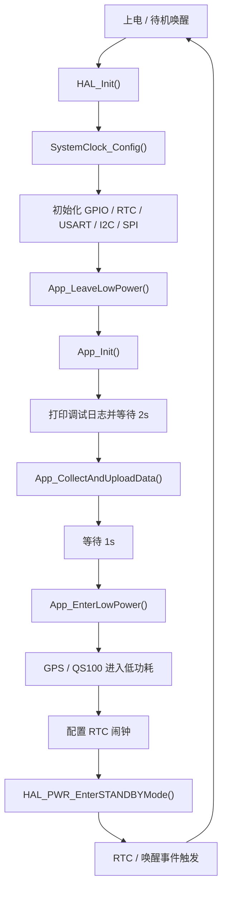
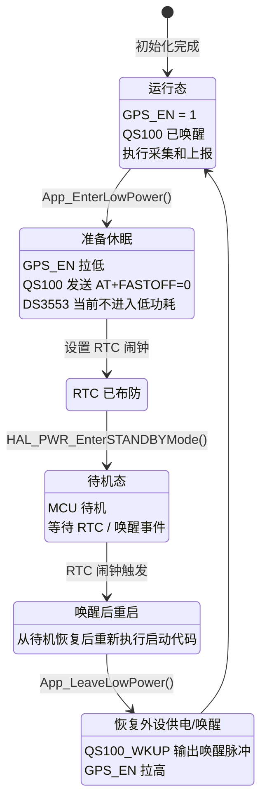
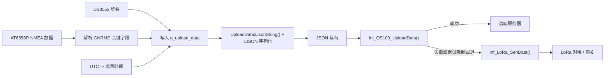
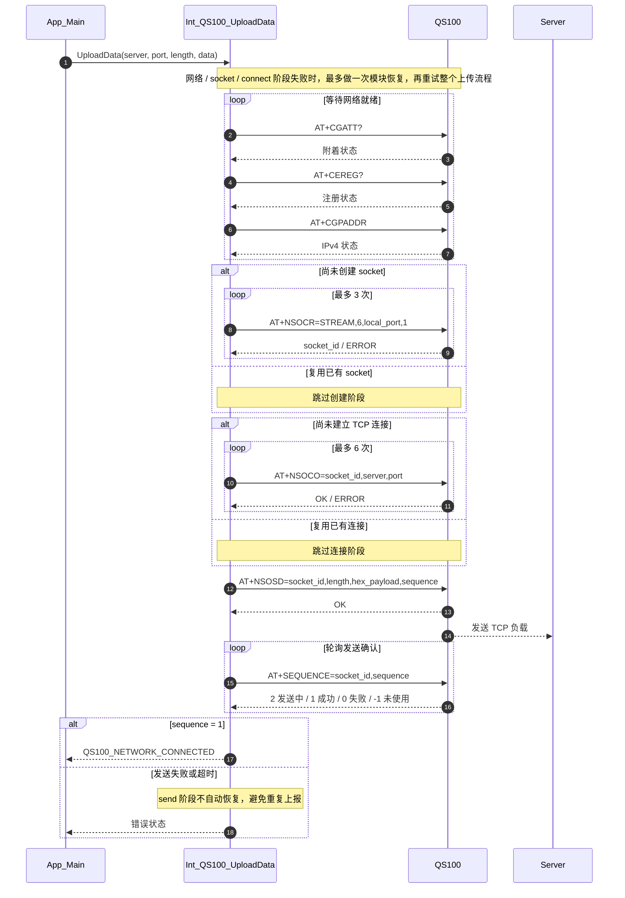

# 01_Pet_Locator

基于 `STM32F103C8T6` 的宠物定位终端固件工程，底座由 `STM32CubeMX + HAL` 生成，并在此基础上叠加了 GPS、计步、NB-IoT、LoRa、JSON 数据封装与低功耗管理能力。

截至 `2026-04-10`，这个仓库已经不再只是早期的 `QS100` 建链实验代码。当前主流程已经演进到：

`采集 GPS/步数 -> 组装 JSON -> 优先 QS100 上报 -> 调试阶段可回落到 LoRa -> 进入低功耗`

项目仍处于联调和验证阶段，不应被误判为量产冻结版本。

## 项目状态

- MCU: `STM32F103C8T6`
- 工程类型: `STM32CubeMX + HAL + Keil MDK-ARM`
- 当前主调试口: `USART1 (PA9/PA10, 115200)`
- 当前 RTC 时钟源: `LSE`
- 当前系统主时钟依赖: `HSE`
- 当前阶段: 功能联调、链路验证、低功耗验证

以下图示均使用 `Mermaid v10` 可兼容语法，目标是贴近当前代码和硬件现状，而不是画一堆看起来完整、实际上脱离源码的装饰图。


## 当前能力清单

- 采集 `AT6558R` GPS 数据，并解析 `$GNRMC` 关键信息。
- 采集 `DS3553` 计步数据。
- 将采集结果写入 `Upload_Data_T`，并通过 `cJSON` 转成 JSON 字符串。
- 通过 `QS100` 执行网络就绪检查、Socket 创建、服务器连接、数据发送和发送结果确认。
- 在调试/回退路径下，支持通过 `LoRa` 模块发送数据。
- 支持 `GPS` 与 `QS100` 的模块级低功耗控制。
- 支持基于 `RTC` 的待机唤醒尝试，主控进入 `STANDBY`。
- 通过 `USART1` 重定向 `printf`，输出调试日志。
- `USART2` 与 `USART3` 已接入 `HAL_UARTEx_ReceiveToIdle_IT()` 不定长接收机制。

## 核心硬件

| 模块 | 型号 / 说明 | 当前用途 |
| --- | --- | --- |
| MCU | `STM32F103C8T6` | 主控 |
| GPS | `AT6558R` | 定位信息采集 |
| 计步器 | `DS3553` | 步数读取 |
| NB-IoT 模块 | `QS100` | 网络接入与服务器上报 |
| LoRa 模块 | `E220xMx` 驱动栈 | 回退通信链路 |

### 系统总览图

这张图回答的是“当前设备到底连了什么、数据和控制从哪里进出”。



## 接口与引脚映射

### 串口 / SPI

| 外设 | 引脚 | 波特率 / 配置 | 用途 |
| --- | --- | --- | --- |
| `USART1` | `PA9 / PA10` | `115200 8N1` | 主调试口，`printf` 重定向输出 |
| `USART2` | `PA2 / PA3` | `9600 8N1` | `AT6558R` GPS 通信 |
| `USART3` | `PB10 / PB11` | `9600 8N1` | `QS100` 通信 |
| `SPI1` | `PA5 / PA6 / PA7` | 主机模式 | `LoRa` 模块数据链路 |

### 控制 GPIO

| 引脚 | 名称 | 方向 | 用途 |
| --- | --- | --- | --- |
| `PA4` | `LoRa_CS` | 输出 | LoRa 片选 |
| `PB0` | `LoRa__RST` | 输出 | LoRa 复位 |
| `PB1` | `LoRa_BUSY` | 输入 | LoRa 忙状态检测 |
| `PB2` | `LoRa_TxEN` | 输出 | LoRa 发射使能 |
| `PB12` | `LoRa_RxEN` | 输出 | LoRa 接收使能 |
| `PB13` | `QS100_WKUP` | 输出 | QS100 唤醒控制 |
| `PB3` | `GPS_EN` | 输出 | GPS 模块上电 / 低功耗控制 |
| `PB5` | `DS3553_CS` | 输出 | 计步器片选 |
| `PB6 / PB7` | `I2C1_SCL / I2C1_SDA` | 复用 | `DS3553` 通信 |

### 时钟相关

- `SystemClock_Config()` 当前依赖 `HSE + PLL`。
- `RTC` 当前使用 `LSE`。
- 若 `HSE` 或 `RTC` 初始化失败，程序会在常规 `printf` 输出前进入 `Error_Handler()`。

这不是枝节，而是“串口完全无输出”时必须优先怀疑的根因。

## 软件架构

### 分层说明

- `Core/`
  - CubeMX 生成的底层初始化代码。
  - 包括时钟、GPIO、I2C、RTC、SPI、USART、中断入口。
- `Com/`
  - 通用组件层。
  - 包括延时、串口调试、数据结构、JSON 处理。
- `Int/`
  - 外设驱动与协议集成层。
  - 包括 `AT6558R`、`DS3553`、`QS100`、`LoRa` 驱动栈。
- `Inf/`
  - 对外设驱动进一步封装的接口层。
  - 当前主要暴露 `LoRa` 上报接口。
- `App/`
  - 应用业务流程层。
  - 当前包含初始化、数据采集上报、低功耗进入/退出。

### 分层关系图

这张图回答的是“代码大致怎么分层，以及谁依赖谁”。



### 关键模块

- `App_Main`
  - 负责应用初始化与“采集 -> 编码 -> 上报”的主流程编排。
- `App_LowPower`
  - 负责模块低功耗切换、RTC 闹钟设置与主控待机。
- `Com_Data`
  - 负责 `Upload_Data_T` 数据组织、UTC 转北京时间、JSON 序列化。
- `Int_QS100`
  - 负责 NB-IoT 模块唤醒、附着检查、Socket 建立、发送确认、异常恢复。
- `Inf_LoRa`
  - 负责 LoRa 初始化、发送、接收轮询入口。

## 当前工程目录

```text
01_Pet_Locator/
├─ App/
│  ├─ Inc/
│  └─ Src/
├─ Com/
│  ├─ Inc/
│  └─ Src/
├─ Core/
│  ├─ Inc/
│  └─ Src/
├─ Drivers/
├─ Inf/
│  ├─ Inf_LoRa.c
│  └─ Inf_LoRa.h
├─ Int/
│  ├─ AT6558R/
│  │  ├─ Inc/
│  │  └─ Src/
│  ├─ DS3553/
│  │  ├─ Inc/
│  │  └─ Src/
│  ├─ LoRa/
│  │  ├─ E220xMx/
│  │  ├─ ebyte_conf.h
│  │  ├─ ebyte_core.c
│  │  └─ ebyte_core.h
│  └─ QS100/
│     ├─ Inc/
│     └─ Src/
├─ MDK-ARM/
├─ 01_Pet_Locator.ioc
├─ AGENTS.md
└─ README.md
```

## 当前主流程

以 `Core/Src/main.c` 为准，上电后的主流程如下：

1. `HAL_Init()`
2. `SystemClock_Config()`
3. 初始化 `GPIO / RTC / USART1 / I2C1 / USART2 / USART3 / SPI1`
4. `App_LeaveLowPower()`
5. `App_Init()`
   - `Int_AT6558R_Init()`
   - `Int_QS100_Init()`
   - `Int_DS3553_Init()`
   - `Inf_LoRa_Init()`
6. 输出调试日志并等待 `2s`
7. 执行 `App_CollectAndUploadData()`
8. 延时 `1s`
9. 执行 `App_EnterLowPower()`，随后进入 `STANDBY`
10. 主循环当前为空转

### 启动到低功耗流程图

这张图比文字列表更适合看清“启动一次之后，程序实际会怎么走，以及休眠后如何回到起点”。



### 低功耗状态图

上一张图偏“流程顺序”，这一张图偏“状态切换”。它强调一个容易被忽略的事实：当前实现进入 `STANDBY` 后，唤醒不是从原地继续跑，而是走一次重新启动流程。



## `App_CollectAndUploadData()` 当前行为

这个函数已经是当前业务主线，不再只是占位函数。它当前会：

1. 尝试获取 GPS 数据。
2. 解析 `$GNRMC` 信息，提取经纬度、速度、日期和时间。
3. 将经纬度从度分格式转换为十进制度。
4. 将 UTC 时间转换为北京时间。
5. 读取 `DS3553` 步数。
6. 通过 `cJSON` 生成 JSON 数据串。
7. 通过 `QS100` 向固定服务器发送数据：

```c
Int_QS100_UploadData("8.135.10.183", 38975, strlen(g_upload_data.json_data),
                     (const uint8_t *)g_upload_data.json_data);
```

8. 若走回退路径，则通过 `LoRa` 发送相同 JSON 数据。

### 采集与上报数据流图

这张图回答的是“数据是怎么从传感器一路变成最终上报载荷的”。



### QS100 上报时序图

前面的数据流图关注“数据怎么走”，这张图关注“`QS100` 这条链路在时序上做了什么”。它对应的是当前 `Int_QS100_UploadData()` 的真实四阶段流程，而不是抽象化后的理想模型。



但是必须实话实说，当前这里仍然带有明显调试痕迹：

- 代码中暂时使用了硬编码 `$GNRMC` 样例字符串辅助调试，不完全依赖实时 GPS 数据。
- 服务器地址与端口仍然硬编码为 `8.135.10.183:38975`。
- `App/Src/App_Main.c` 内存在 `status = 1;` 的调试代码，这会强制走 `LoRa` 分支。

所以现阶段它更准确的定位是“联调主流程”，而不是“最终业务闭环”。

## 构建与开发

### 推荐环境

| 工具 | 建议版本 |
| --- | --- |
| `Keil MDK-ARM` | `5.x` |
| `STM32CubeMX` | 与当前 `.ioc` 兼容即可 |
| `STM32Cube FW_F1` | `V1.8.7` |

### 打开工程

使用 Keil 打开：

```text
MDK-ARM/01_Pet_Locator.uvprojx
```

### 重新生成代码

如需修改引脚、时钟、外设配置，使用 CubeMX 打开：

```text
01_Pet_Locator.ioc
```

注意：

- 修改 CubeMX 生成文件时，优先将自定义代码放在 `USER CODE` 区域。
- 直接改自动生成区而不做隔离，后续重新生成时被覆盖几乎是必然事件。

## 当前调试重点

### 串口无输出时

优先按下面顺序排查：

1. 板级供电、下载、复位是否正常。
2. `HSE` 外部时钟是否真实可用。
3. `SystemClock_Config()` 是否执行成功。
4. `MX_RTC_Init()` 是否提前失败。
5. `MX_USART1_UART_Init()` 是否执行。
6. `printf` 重定向是否被正确编译。
7. 外部 USB 转串口链路是否正常。

### 当前已知风险

- `main.c` 虽然已经切入 `App` 层，但流程仍偏联调，配置项尚未抽离。
- 服务器地址、端口、调试状态变量仍有硬编码。
- `LoRa` 回退链路已接入，但当前逻辑仍带明显 debug 代码。
- 低功耗流程是刚新增的实现，`RTC` 闹钟唤醒、模块恢复顺序仍需实机验证。
- 仓库内部分中文注释和日志字符串存在编码异常，会持续拉低维护效率。
- `Error_Handler()` 仍是“关中断 + 死循环”，故障现场信息不足。

## 仓库内参考文档

- `QS100_建链流程优化报告.md`
- `QS100_接收逻辑缺陷与优化建议.md`
- `QS100_服务器连接问题深度分析报告.md`

这些文档的价值不在于“结论永远正确”，而在于它们记录了已经踩过的坑，能减少重复试错。
